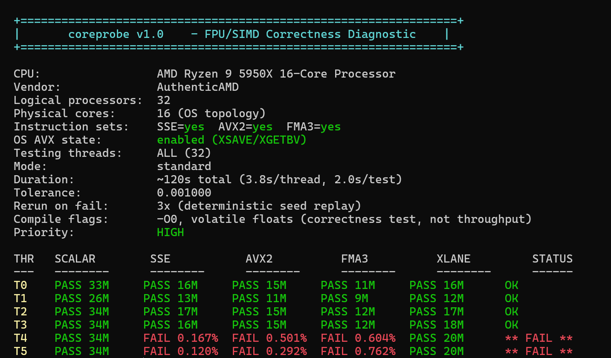

# coreprobe

[](https://github.com/MilosLord/coreprobe/actions/workflows/ci.yml)

Per-core FPU/SIMD correctness diagnostic for x86-64. Catches silicon defects that memtest86+, Prime95, and WHEA miss.

Developed after discovering a Ryzen 9 5950X with a single core whose SIMD units produced incorrect results under quaternion math, causing Unreal Engine 5 `IsRotationNormalized()` assertion crashes that only appeared when the OS scheduler placed work on that specific core.



## Tests

| Test | Instruction Path | What It Catches | Comparison |
|------|-----------------|-----------------|------------|
| `SCALAR` | Scalar `1/sqrt` | Basic FPU errors | Tolerance |
| `SSE3` | 128-bit `rsqrt+NR` / `sqrt+div` | SSE3 pipeline faults | Tolerance |
| `AVX2` | 256-bit `sqrt+div` (2 quaternions) | AVX2 execution unit errors | Tolerance |
| `FMA3` | FMA `rsqrt+NR` / `sqrt+div` | Fused multiply-add faults | Tolerance |
| `AVX512` | 512-bit `sqrt+div` (4 quaternions, AVX-512F) | AVX-512 execution unit errors | Tolerance |
| `XLANE` | `vperm2f128`, `vpermd` | Cross-lane data corruption | Bit-exact |

The **XLANE** test specifically targets the 128-bit lane boundary in AVX2 registers -- a known weak point where data corruption can occur even when lane-local arithmetic appears healthy.

The **AVX512** test runs only where the CPU reports AVX-512F *and* the OS has enabled AVX-512 state (XCR0 bits 5:7); everywhere else it is skipped automatically. All tests are dispatched at runtime -- one binary runs on any x86-64 CPU.

## Build

Make (Linux/MinGW):
```
make
```

CMake (any platform):
```
cmake -B build && cmake --build build
```

Manual -- MinGW:
```
g++ -O0 -std=c++20 -o coreprobe.exe coreprobe.cpp
```

Manual -- MinGW, self-contained exe (no DLL dependencies):
```
g++ -O0 -std=c++20 -static -static-libgcc -static-libstdc++ -o coreprobe.exe coreprobe.cpp
```

Manual -- MSVC:
```
cl /Od /std:c++20 /EHsc /W4 /D_CRT_SECURE_NO_WARNINGS coreprobe.cpp /Fe:coreprobe.exe
```

Manual -- Linux:
```
g++ -O0 -std=c++20 -pthread -o coreprobe coreprobe.cpp
```

> **`-O0` / `/Od` is intentional.** This is an arithmetic correctness test, not a throughput benchmark. Optimizations can mask hardware faults by reordering or eliminating floating-point operations. Test functions additionally carry per-function optimization-off pragmas, so they stay protected under any build type.
>
> **No global `-mavx2 -mfma` / `/arch:` flags needed.** GCC/Clang use per-function `target()` attributes for SIMD dispatch; MSVC makes AVX/FMA/AVX-512 intrinsics available without `/arch:` flags. The binary runs on any x86-64 CPU and skips unsupported tests at runtime.

## Usage

```
coreprobe [seconds] [threads...] [flags]
```

| Example | Description |
|---------|-------------|
| `coreprobe` | All threads, 120s target (actual may be longer, min 2s/test) |
| `coreprobe 60` | All threads, 60s target |
| `coreprobe 20 4` | Thread 4 only, 20 seconds |
| `coreprobe 60 0-15` | Threads 0-15, 60s target (actual may be longer, min 2s/test) |
| `coreprobe --soak` | Extended 10-minute soak test |
| `coreprobe --socket 0` | Only threads on socket 0 |
| `coreprobe --repeat 5` | Run 5 full passes |
| `coreprobe --until-fail` | Repeat until failure detected |
| `coreprobe 30 --json` | Write results to `coreprobe_results.json` |
| `coreprobe --pause` | Wait for Enter before exiting |
| `coreprobe --version` | Print version and exit |

**Stopping a run:** Ctrl+C stops gracefully -- the current check finishes, completed results are summarized, and the exit code is `130`. Press Ctrl+C a second time to abort immediately. Tests that were not reached are reported as skipped, never as failures.

## Output

```
T0   SCALAR PASS 12M  SSE3 PASS 8M  AVX2 PASS 6M  FMA3 PASS 10M  AVX512 PASS 9M  XLANE PASS 9M   OK
T1   SCALAR PASS 11M  SSE3 PASS 8M  AVX2 PASS 6M  FMA3 PASS 9M   AVX512 PASS 8M  XLANE PASS 9M   OK
```

- `T0` -- logical thread 0
- `12M` -- millions of iterations completed
- `OK` / `FAIL` -- per-thread verdict

On failure, coreprobe automatically re-runs with the same deterministic seed to confirm reproducibility:
- **Confirmed** -- re-run also failed. Hardware defect.
- **Transient** -- not reproduced. Marginal stability.

## Core Map

After testing, a visual core map shows pass/fail status per physical core:

```
Core Map (8 physical cores, OS topology):

[00] [01] [02] [03] [04] [05] [06] [07]

[OK] = pass  [XX] = FAIL  [--] = not tested
```

Physical core topology is detected via OS APIs (Windows `GetLogicalProcessorInformationEx`, Linux sysfs) -- no hardcoded SMT assumptions.

## Design

- **Correctness, not throughput.** `-O0` and `volatile` barriers ensure every FP operation executes through hardware, not optimized away by the compiler. Pragma-based optimization guards protect test functions even under `-O2`/`-O3`/PGO.
- **Sequential per-core testing.** A faulty execution unit produces wrong results regardless of SMT contention. Sequential testing gives clean per-core fault attribution.
- **Verified pinning.** After setting affinity, coreprobe confirms the thread actually landed on the requested CPU (`GetCurrentProcessorNumberEx` / `sched_getcpu`) before attributing results to it.
- **Processor-group correct.** On Windows systems with more than 64 logical processors, CPUs are mapped through the OS group topology (`RelationGroup` active masks) -- groups smaller than 64 CPUs (NUMA splits) are handled correctly.
- **Deterministic PRNG.** xoshiro128** seeded per-test enables exact failure replay for confirmation.
- **Dual-path verification.** SSE3 and FMA3 tests run both `rsqrt+Newton-Raphson` (approximate) and `sqrt+div` (precise) paths on the same input, each judged against its own tolerance.
- **Cross-platform.** Windows (Win32 API) and Linux (pthreads/sysfs). Supports >64 logical processors via processor groups (Windows) and `CPU_ALLOC` (Linux).

## When to Use

- Validating CPU overclock / PBO stability
- Testing new hardware for silicon defects
- Diagnosing intermittent calculation failures in production
- Per-core verification after BIOS/firmware updates
- Checking silicon quality (binning)

## Exit Codes

| Code | Meaning |
|------|---------|
| `0` | All tests passed |
| `1` | Failures detected (or no thread could be tested) |
| `2` | Usage error (bad flag, duration, or thread selector) |
| `130` | Interrupted (Ctrl+C / SIGTERM) |

## Development

- `clang-format` and `clang-tidy` configurations ship with the repository; CI enforces a clean `clang-tidy` run, a `-Werror` GCC build, and a `/W4 /WX` MSVC build.
- No function exceeds 30 lines (enforced by `readability-function-size`).

## License

MIT
